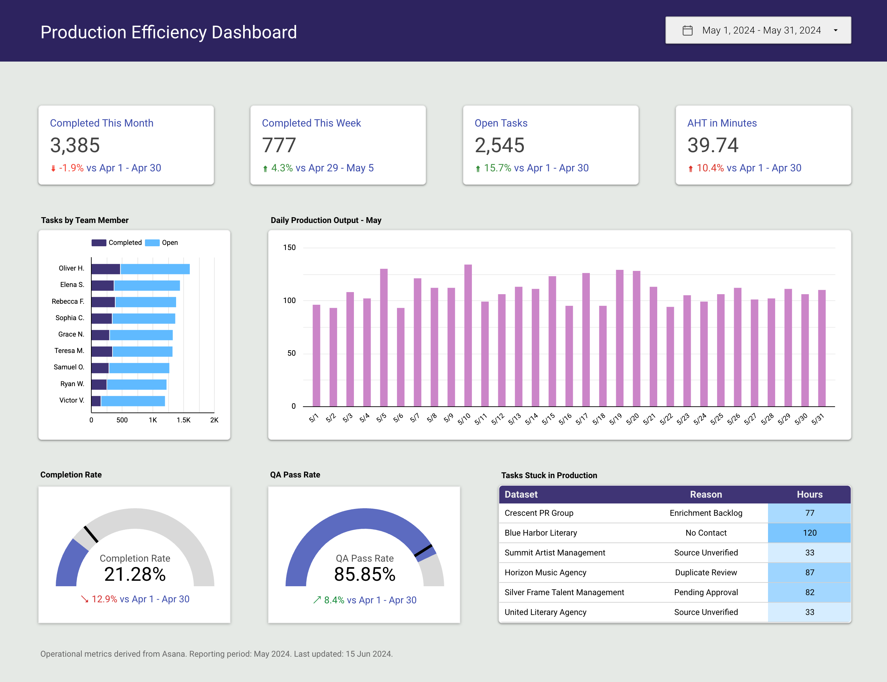

# Production Efficiency Dashboard
###### _Tools: Asana API, Google Cloud Scheduler, BigQuery, Looker Studio_
<br/>


## **Overview**
A fast-paced data company that relies on Asana for daily task management routinely conducts performance analyses across multiple timeframes (daily, weekly, monthly, quarterly, and annually). As operational data continued to grow, manually exporting reports from multiple Asana projects became inefficient, resulting in duplicated effort, inconsistent datasets, and delayed reporting.

To address this, a scalable cloud-based ETL pipeline was developed to automate data extraction, centralize storage, and streamline reporting. Production data is automatically retrieved from the Asana API on a scheduled basis, transformed and stored in BigQuery, and visualized through interactive Looker Studio dashboards. This centralized architecture serves as the single source of truth for task, roster, and team data while enabling flexible SQL analysis and automated reporting.

## **Problem Statement**

Our team routinely analyzes Asana data to assess operational metrics such as task volume, project completion rate, and team productivity across multiple reporting periods. While Asana is well suited for project management, it is not designed to support historical reporting or complex analytical queries.

This process led to:
* **Manual reporting workflows**: Operational reports depended on repeatedly exporting project data before analysis.
* **Inconsistent datasets**: Separate exports often contained overlapping records and varying formats.
* **Delayed reporting**: Significant time was spent preparing data before meaningful analysis could begin.

The challenge was to automate data collection and centralize reporting, ensuring consistent, reliable, and timely operational insights.

## **ETL Pipeline Design & Implementation**

The workflow began by identifying inefficiencies caused by recurring manual exports from multiple Asana projects. Since operational reports were generated frequently, analysts spent considerable time downloading, validating, and consolidating datasets before each reporting cycle.

To streamline this process, an automated Extract-Transform-Load (ETL) pipeline was designed to collect operational data directly from the Asana API, standardize it within BigQuery, and serve it to downstream reporting tools.

### Extract

A Python application connects to the Asana REST API using a secure Personal Access Token to retrieve task data from multiple production projects. The extraction process captures task details, subtasks, assignees, project information, due dates, completion status, and custom metadata required for reporting.

The extraction job is automatically triggered by Google Cloud Scheduler at scheduled intervals, eliminating the need for recurring manual CSV exports while ensuring new production data is consistently collected.

### Transform

Raw data is first loaded into staging tables within BigQuery before undergoing SQL-based transformations. Additional validation and reference data are maintained in Google Sheets for lookup values and business rules where appropriate.

The transformation process standardizes field names, removes duplicate records, normalizes timestamps, resolves missing values, and aligns relationships between tasks, rosters, team members, and partner organizations. These transformations produce analytics-ready datasets optimized for reporting.

### Load

The transformed datasets are loaded into BigQuery, which serves as the centralized cloud data warehouse for operational reporting. Tables are organized using a relational schema to support efficient SQL queries and scalable analytics. Key tables include:

* **Tasks**: Containing task-level data such as page title, subtasks, assignee, related roster, project name, due date, and current status.
* **Team**: Listing team members with associated email addresses and shift schedules.
* **Rosters**: Representing grouped workflows, each with an assignee, data source, subtasks, and deadlines.
* **Partners**: Capturing external partner details like name, company, email, and their associated rosters or tasks.

## **Data Collection and Preparation**
Operational data is automatically collected from multiple Asana projects through scheduled API requests and stored in BigQuery. Reference tables maintained in Google Sheets are used to support lookups, validation, and standardized business logic during the transformation process.

### Dataset Overview
* **Rows (Records)**: 48,000+
* **Columns (Variables)**: 76
* **Source**: Asana API, automatically extracted through scheduled ETL processes and stored in BigQuery

Each record represents a unique task or entity, linked to other entities like team members, rosters, and partner companies.

## **Database Schema & Data Structure**

A relational schema was implemented within BigQuery using the following core tables:
1. Tasks Table
1. Team Table
1. Rosters Table
1. Partners Table
   
### Entity Relationships

* `rosters.roster_title` connects with `tasks.roster`
* `rosters.assignee` connects with `team.member_name`
* `partners.name` links to `tasks.data_source` and `rosters.data_source`

These relationships enable efficient SQL queries across the operational workflow while maintaining referential integrity.

## **Data Lookup and SQL Querying**

Once the data warehouse was established, SQL queries in BigQuery replaced manual spreadsheet filtering. These queries were used to generate operational insights and provide datasets for dashboard visualizations.

1. Task Volume by Month
```sql
SELECT 
  MONTH(due_date) AS month,
  COUNT(*) AS total_tasks
FROM tasks
WHERE status != 'Cancelled'
GROUP BY MONTH(due_date);
```

1. Average Handling Time per Team Member
```sql
SELECT 
  t.assignee,
  AVG(DATEDIFF(t.due_date, r.due_date)) AS avg_handling_days
FROM tasks t
JOIN rosters r ON t.roster = r.roster_title
GROUP BY t.assignee;
```

1. Tasks by Partner
```sql
SELECT 
  p.name AS partner,
  COUNT(t.page_title) AS task_count
FROM tasks t
JOIN partners p ON t.data_source = p.name
GROUP BY p.name;
```

These queries serve as building blocks for dashboard visualizations and KPI summaries.

## **Data Analysis and KPI Calculation**

After retrieving clean, structured datasets from BigQuery, SQL was used to calculate operational metrics while Google Sheets was used for lightweight validation and supporting lookup tables where necessary.

### Key Operational KPIs

Here are some of the most relevant performance metrics we tracked:

* **Completed Tasks (Monthly/Weekly)**: Total number of tasks completed within the selected reporting period.
* **Open Tasks**: Tasks that remain in progress or have not yet been completed.
* **Average Handling Time (AHT)**: Average number of minutes taken by the team to complete a task.
* **Tasks by Team Member**: Distribution of workload and completed tasks across individual contributors.
* **Daily Production Output**: Number of tasks completed each day, providing visibility into productivity trends and capacity.
* **Completion Rate**: Percentage of assigned tasks successfully completed during the reporting period.
* **QA Pass Rate**: Percentage of completed tasks that passed quality assurance review on the first evaluation.
* **Tasks Stuck in Production**: Tasks flagged as delayed, blocked, or requiring additional action before completion.

These KPIs focus exclusively on operational performance and production efficiency.

## **Visualization in Looker Studio**



The final product is a dynamic Looker Studio dashboard that integrates all key KPIs and trends into a user-friendly visual format.

### Dashboard Components

* **Monthly Production Overview**: Bar chart showing completed tasks per day.
* **Tasks by Team Member**: Horizontal stacked bar charts showing comparison of completed and open tasks by team member.
* **Team Performance**: Scorecards highlighting key operational metrics, including total open tasks, completed tasks, and Average Handling Time (AHT).
* **Performance Indicators**: Gauge cards for Completion Rate and QA Pass Rate.
* **Production Bottlenecks**: Table of tasks stuck in production, including delay reasons and hours blocked.
* **Filter Options**: Date Range filter for analyzing performance across selected periods.

### Data Pipeline

1. Google Cloud Scheduler automatically triggers the ETL pipeline.
1. Python extracts production data from the Asana API.
1. Raw data is loaded into BigQuery staging tables.
1. SQL transformations generate analytics-ready reporting tables.
1. Looker Studio connects directly to BigQuery and refreshes dashboards automatically.

The dashboard enables stakeholders to monitor production performance in near real-time, identify operational bottlenecks, and evaluate productivity trends across multiple reporting periods.

## **Conclusion**

This project transformed a repetitive and manual reporting process into an automated cloud-based analytics solution. By integrating the Asana API with BigQuery and Looker Studio through a scheduled ETL pipeline, operational data became centralized, consistent, and readily available for analysis. The solution reduced manual effort, improved reporting accuracy, and provided stakeholders with timely insights to support data-driven operational decisions.
