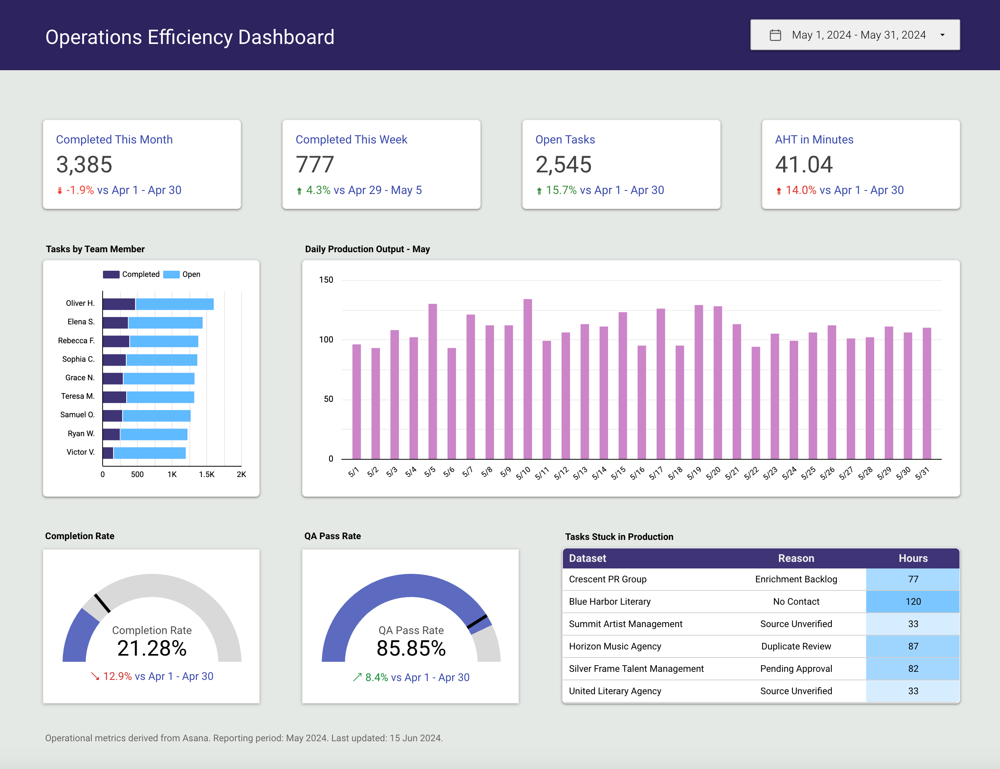

# Operations Efficiency Dashboard
###### _Tools: Microsoft Excel, MySQL, Looker Studio_
<br/>


## **Overview**
A fast-paced data company that is reliant on Asana for daily task management routinely conducts performance analyses across multiple timeframes (daily, weekly, monthly, quarterly, and annually). Each analysis cycle required new exports from different Asana projects, which often resulted in overlapping data, duplicated effort, and inconsistent formatting.

To address this, a scalable and centralized approach was developed that eliminated redundant exports and made operations reporting significantly more efficient. A complete end-to-end ETL pipeline was designed and implemented, feeding into a local MySQL database that serves as the single source of truth for task, roster, and team data. The new structure enables flexible data exploration using SQL, automated exploratory analysis in Python, and final reporting through interactive Looker Studio dashboards.

## **Problem Statement**

Our team routinely analyzes data from Asana to assess operational metrics like task volume, project completion rate, and productivity over various time intervals. Because Asana does not natively support long-term storage or complex querying, we exported data manually from different Asana projects at every reporting cycle.

This process led to:
* **Redundant exports**: The same data was exported multiple times across different timeframes.
* **Version control issues**: Multiple spreadsheet versions caused inconsistencies.
* **Delayed reporting**: Time-consuming data prep slowed down our ability to act on insights.

The challenge was to automate and centralize our data pipeline, ensuring consistency, accessibility, and speed in our analysis process.

## **ETL Pipeline Design & Implementation**

The workflow began with identifying the inefficiencies caused by repeated Asana data exports, particularly for recurring operational reviews. Data exports were often customized for individual reporting requests, creating multiple versions of the same underlying data.

To streamline this, an Extract-Transform-Load (ETL) pipeline was implemented to ingest and standardize data from various Asana project exports.

### Extract

Raw data was extracted in spreadsheet form from multiple Asana projects. These exports varied in structure depending on the reporting cycle or the team that generated them. Each export contained partial views of operational data like tasks, subtasks, assignees, and related metadata.

### Transform

Before integration into the database, the exported spreadsheets were cleaned and merged using VLOOKUP and INDEX-MATCH in Excel. This process resolved structural inconsistencies and aligned fields such as due dates, assignees, task descriptions, and project identifiers. Key variables were standardized across all files to ensure referential consistency across related tables. Additional transformations addressed duplicated entries, timezone normalization, and missing value imputation.

### Load

Transformed data was then imported into a local MySQL database built to reflect the structure of the operational workflow. Tables were normalized and indexed to enable efficient querying and support scalable data analysis. Key tables included:

* **Tasks**: Containing task-level data such as page title, subtasks, assignee, related roster, project name, due date, and current status.
* **Team**: Listing team members with associated email addresses and shift schedules.
* **Rosters**: Representing grouped workflows, each with an assignee, data source, subtasks, and deadlines.
* **Partners**: Capturing external partner details like name, company, email, and their associated rosters or tasks.

## **Data Collection and Preparation**
The raw data was initially exported from multiple Asana projects, which led to fragmented spreadsheets with varying formats. We consolidated these using VLOOKUP and INDEX-MATCH in Excel to form a master dataset.

### Dataset Overview
* **Rows (Records)**: 48,000+
* **Columns (Variables)**: 76
* **Source**: Aggregated from various Asana project exports, manually merged via spreadsheets before uploading to SQL

Each record represents a unique task or entity, linked to other entities like team members, rosters, and partner companies.

## **Database Schema & Data Structure**

We designed a relational schema with the following core tables:
1. Tasks Table
1. Team Table
1. Rosters Table
1. Partners Table
   
### Entity Relationships

* `rosters.roster_title` connects with `tasks.roster`
* `rosters.assignee` connects with `team.member_name`
* `partners.name` links to `tasks.data_source` and `rosters.data_source`

These relational links enable comprehensive queries across the operational structure.

## **Data Lookup and SQL Querying**

Once the database was established, we replaced spreadsheet filtering with precise SQL queries. Here are examples of queries we used to access key insights:

1. Task Volume by Month
```sql
SELECT 
  MONTH(due_date) AS month,
  COUNT(*) AS total_tasks
FROM tasks
WHERE status != 'Cancelled'
GROUP BY MONTH(due_date);
```

1. Average Handling Time per Team Member
```sql
SELECT 
  t.assignee,
  AVG(DATEDIFF(t.due_date, r.due_date)) AS avg_handling_days
FROM tasks t
JOIN rosters r ON t.roster = r.roster_title
GROUP BY t.assignee;
```

1. Tasks by Partner
```sql
SELECT 
  p.name AS partner,
  COUNT(t.page_title) AS task_count
FROM tasks t
JOIN partners p ON t.data_source = p.name
GROUP BY p.name;
```

These queries serve as building blocks for dashboard visualizations and KPI summaries.

## **Data Analysis and KPI Calculation**

After retrieving cleaned, structured data via SQL, we performed further analysis using Excel.

### Key Operational KPIs

Here are some of the most relevant performance metrics we tracked:

* **Completed Tasks (Monthly/Weekly)**: Total number of tasks completed within the selected reporting period.
* **Open Tasks**: Tasks that remain in progress or have not yet been completed.
* **Average Handling Time (AHT)**: Average number of minutes taken by the team to complete a task.
* **Tasks by Team Member**: Distribution of workload and completed tasks across individual contributors.
* **Daily Production Output**: Number of tasks completed each day, providing visibility into productivity trends and capacity.
* **Completion Rate**: Percentage of assigned tasks successfully completed during the reporting period.
* **QA Pass Rate**: Percentage of completed tasks that passed quality assurance review on the first evaluation.
* **Tasks Stuck in Production**: Tasks flagged as delayed, blocked, or requiring additional action before completion.

These KPIs are purely operational in focus and exclude any marketing, revenue, or customer-related metrics.

## **Visualization in Looker Studio**



The final product is a dynamic Looker Studio dashboard that integrates all key KPIs and trends into a user-friendly visual format.

### Dashboard Components

* **Monthly Production Overview**: Bar chart showing completed tasks per day.
* **Tasks by Team Member**: Horizontal stacked bar charts showing comparison of completed and open tasks by team member.
* **Team Performance**: Scorecards highlighting key operational metrics, including total open tasks, completed tasks, and Average Handling Time (AHT).
* **Performance Indicators**: Gauge cards for Completion Rate and QA Pass Rate.
* **Production Bottlenecks**: Table of tasks stuck in production, including delay reasons and hours blocked.
* **Filter Options**: Date Range filter for analyzing performance across selected periods.

### Data Pipeline

1. SQL queries extract pre-cleaned datasets.
1. Exported as `.csv` and analyzed in Excel.
1. The `.xlxs` file is saved and uploaded to Google Sheets. It replaces the file that is already connected directly to Looker Studio.
1. Looker Studio refreshes periodically to reflect updated analysis results.

The dashboard allows stakeholders to monitor performance in real-time, spot anomalies, and evaluate trends over time.

## **Conclusion**

This project successfully transformed a repetitive and error-prone data export process into a streamlined analytical workflow. By creating a centralized SQL database and connecting it to Looker Studio, we reduced manual work, improved accuracy, and enhanced our ability to extract meaningful operational insights.
